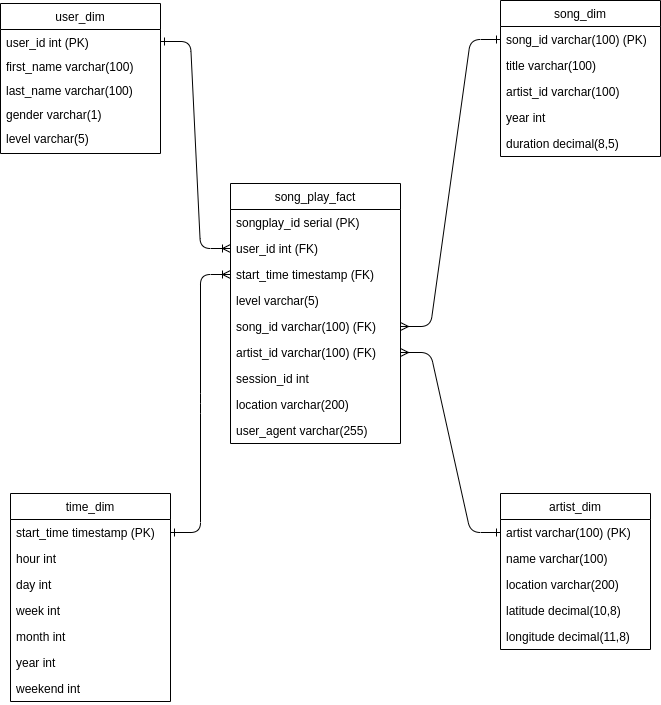

# Sparkify Song Data Warehouse

### Developer Details

> Name: Darren Foley

> Email: <darren.foley@ucdconnect.ie>

<br/>

### File List 

| FileName          | Description                                                    |
|------------------:|:---------------------------------------------------------------|
| create_tables.py  | Drops and creates tables for Star Schema                       |
| cron.example      | Example cron file for scheduling the etl.py                    |
| Dashboard.ipynb   | Sample query and graph for front end visualization             |
| etl.ipnb          | etl testing Jupter notebook                                    |
| README.md         | Markdown README file                                           |
| requirements.txt  | List of pip dependencies                                       |
| run.sh            | Bash wrapper script for running create_tables.py and etl.py    |
| sql_queries.py    | Contains SQL code for table creation and SQL insert statements |
| test.ipyb         | Test notebook for testing data quality                         |


<br/>

### How to Run Scripts

<p>A shell wrapper script </p>

**run.sh**

<p> was created to encapsulate the drop, creation and load steps. Simply run the script from the command line like so:</p>

```
/home/workspace# ./run.sh
```

<p>This will run create_tables.py followed by the etl.py script.</p>

<p>You should see output like the following. There are 71 song files and 30 log files in total</p>

```
....
71/71 files processed.

.....
30/30 files processed.
```

<br/>

### Project High Level Summary

<p>This project involves the creation of an analytical (OLAP) database to meet reporting requirements for Sparkify, a startup streaming service provider. Until now, sparkify did not have a convenient way to create reports on how users interact their platform. The goal is to provide regular reports on user behaviour. 
    
The project contains three parts;
</p>

1. Backend Design: Postgres database schema
2. ETL Design: python/SQL pipeline
3. Frontend Design: Python dashboard/Report on user behaviour


<br/>

### Design Overview

**1. Backend Design**

<p>The database is a PostgreSQL instance (v9.5.23) deployed on a single core, 4GB Ubuntu Virtual Machine (v16.04.7 LTS).</p>

<p>A star schema configuration was chosen to improve read performance of the reports. There were 4 dimension tables and 1 fact table.</p>


| TableName      | Type        | PrimaryKey  | Description                                                                   |
|--------------  |:-----------:|------------:|:-----------------------------------------------------------------------------:|
| song_play_fact | Fact        | songplay_id | Stores numeric information on song plays.                                     |
| user_dim       | Dimension   | user_id     | Information relating to end users of the Sparkify platform.                   |
| song_dim       | Dimension   | song_id     | Information relating to songs, duration, release date etc.                    |
| artist_dim     | Dimension   | artist_id   | Information relating to artists, location etc.                                |
| time_dim       | Dimension   | start_time  | Time dimension allows for data to be rolled up over different time durations. |


*Conceptual Model Diagram*


<br/>
<br/>




*Logical Model Diagram*

<br/>
<br/>

**2. ETL Design**

<p>The ETL pipeline heavily utilises psycopg2 for interacting with the postgres database. It uses a cursor object to pass SQL statements to the cur.execute() method and provide an easy way to parameterize queries so they are more extensible. Pandas was used for data manipulation/filtering. Embedded SQL statements were used to insert data into the database tables. In order to avoid primary key violations the "ON CONFLICT DO NOTHING" statement was used as there may be duplicate artist_id's & song_id's present in the source data.</p>


*ETL Overview*

<p>As shown above, the ETL process is a batch based data feed where data is loaded into the destination database. Currently, the etl scripts are scheduled through crontab to run on a daily basis at 9AM (see cron.example).</p>


<br/>

**3. Front End Design**

<p>A report on user behaviour was created as a proof of concept to demonstrate the utility of new data warehouse.</p>

<p>The following question was asked (1) "Who are the top 10 most active users?</p>

```
SELECT
    sp.user_id,
    u.first_name,
    u.last_name,
    u.level,
    u.gender,
    COUNT(DISTINCT sp.session_id) as session_count
FROM song_play_fact sp
INNER JOIN user_dim u
ON u.user_id = sp.user_id
GROUP BY 
    sp.user_id,
    u.first_name,
    u.last_name,
    u.level,
    u.gender
ORDER BY session_count DESC
LIMIT 10
```


<br/>

As shown in the above graph **Chloe Cuevas** is the most active female user and **Ryan Smith** is the most active male user.